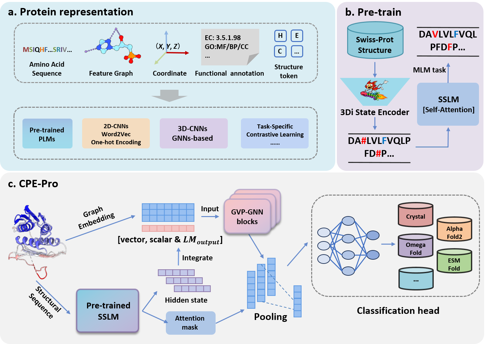

# CPE-Pro: A Structure-Sensitive Deep Learning Method for Protein Representation and Origin Evaluation

## 🚀 Introduction

CPE-Pro: A structure-sensitive supervised deep learning model, Crystal vs Predicted Evaluator for Protein Structure, to represent protein and evaluate the origin of protein structures. incorporates a pre-trained protein structural language model, structural sequence language model (SSLM), and geometric vector perceptron-graph neural networks (GVP-GNN) to learn protein structure representations and capture structural differences.

The sequential encoder of CPE-Pro is the Structural Sequence Language Model, SSLM. First, the protein structure data search tool **[Foldseek](https://github.com/steineggerlab/foldseek)** is used to convert protein structures into **structural sequences**. Next, using the 3Di alphabet as the vocabulary for structural elements and based on the Transformer architecture, we pre-train a protein structural language model, SSLM, from scratch. This aims to effectively model the structural sequences of proteins. The pre-training process employs the classic **[masked language modeling (MLM) objective](https://arxiv.org/abs/1810.04805)**, predicting masked elements based on the context of the structural sequences.



## 📑 Results

### News
[2025.05.13] Congratulations! Our paper was accepted by **[Interdisciplinary Sciences: Computational Life Sciences}(https://link.springer.com/journal/12539)** (INSC).

### Paper Results

We compared CPE-Pro to various embedded-based deep learning methods on the dataset **CATH-PFD**. Our analysis includes pre-trained PLMs(**ESM1b, ESM1v, ESM2, ProtBert, Ankh**) combined with GVP-GNN as a model with amino acid (AA) sequence and structure input, and the structure-aware PLM **SaProt**.

(1) Results show CPE-Pro demonstrates exceptionally high accuracy performance in two structure origin evaluation tasks (C-A: Crystal - AlphaFold2, C-M: Crystal - Multiple prediction models).

(2) Feature visualization method powerfully demonstrates pre-trained SSLM's excellence in capturing structural differences.

(3) Preliminary experimental results indicate that, compared to models based on AA sequences, structural sequences enable language models to learn more informative protein features. When combined with protein graph embeddings, they further enrich and optimize structural representations.

## 🛫 Requirement

### Conda Enviroment

Please make sure you have installed **[Anaconda3](https://www.anaconda.com/download)** or **[Miniconda3](https://docs.conda.io/projects/miniconda/en/latest/)**.

Then
```
cd CPE-Pro-main
```
You can create the required environment using the following two methods.
```
conda env create -f environment.yaml
conda activate cpe-pro
```
or
```
conda create -n cpe-pro python=3.8.18
conda activate cpe-pro
pip install -r requirements.txt
```

### Hardware

All protein folding, pre-training, and experiments were conducted on 8 NVIDIA RTX 3090 GPUs. If you intend to utilize a larger pre-trained SSLM or a deeper GVP-GNN within CPE-Pro, additional hardware resources may be necessary.

## 🧬 Start with CPE-Pro

### Dataset Information

The link to the dataset can be found in the `source` folder.

(1) **[Swiss-Prot](https://ftp.ebi.ac.uk/pub/databases/alphafold/latest/swissprot_pdb_v4.tar)**: The pre-training of the protein structural language model, SSLM utilized 109,334 high pLDDT score (>0.955) protein structures from the Swiss-Prot database. We organized the protein structural sequences used in the pre-training process into a FASTA file.

(2) **[CATH](http://download.cathdb.info/cath/releases/all-releases/v4_3_0/non-redundant-data-sets/)**: Dataset **cath-dataset-nonredundant-S40-v4_3_0.pdb** as our benchmark, then we extracted the AA sequences of proteins from the benchmark dataset. Using multiple state-of-the-art protein structure prediction models, we predicted the structures corresponding to these AA sequences. These structures were organized and categorized based on individual proteins and prediction models to construct a Protein Folding Dataset, **CATH-PFD**, which will be used for training and validating CPE-Pro.  

(3) **[SCOPe](https://scop.berkeley.edu/)**: We selected a subset of gene domain sequences from the non-redundant Astral SCOPe 2.08 database in SCOPe, where the identity between sequences is less than 40%. From this subset, we focused on all-α helical proteins (2,644) and all-β sheet proteins (3,059) and filtered the corresponding structural sets in the database.

(4) **Case Study**: Proteins BLAT ECOLX and CP2C9 HUMAN. In three structural prediction models, both proteins achieved pLDDT scores above 0.9, indicating high accuracy in structure prediction with minimal deviation from the crystal structure. The protein structures used in case study can be found in the `source` folder.

(5) We have open-sourced the **[pre-trained SSLM](https://huggingface.co/gwenrui/Pretrained_SSLM/tree/main)** and the model weights of **[CPE-Pro](https://huggingface.co/gwenrui/CPE-Pro_29M/tree/main)** for structural origin evaluation on Hugging Face. The weight files of various PLMs can be downloaded from the **[Transformers library](https://huggingface.co/models)**. The protein structure datasets used for **[CPE-Pro training](https://huggingface.co/datasets/gwenrui/CATH-PFD/tree/main)**, **[visualization experiments](https://huggingface.co/datasets/gwenrui/SCOPE-2.08-filter/tree/main)**, and **[SSLM pre-training](https://huggingface.co/datasets/gwenrui/Swiss-Prot_filter_by_pLDDT/tree/main)** are also uploaded to Hugging Face.

### Pretrain SSLM and Train CPE-Pro

(1) See the `pretrain.py` script for pretraining details. Examples can be found in `pretrain` folder.

(2) See the `train.py` script for training details. Examples can be found in `scripts` folder.
